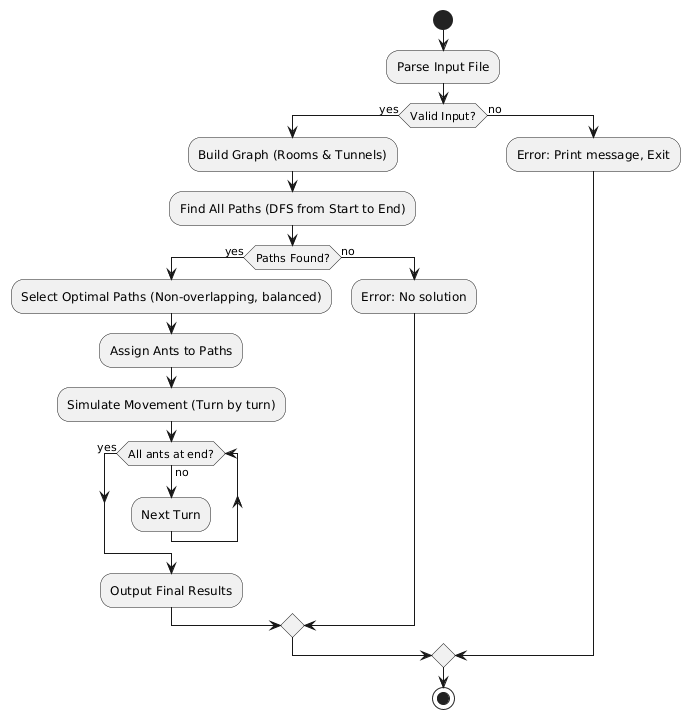
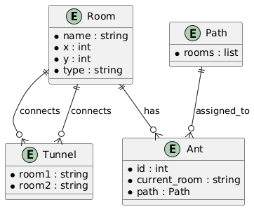

# AntFinder 🐜

[](https://golang.org/)
[](LICENSE.md)

Welcome to **AntFinder**, a terminal-based application built with Go that simulates efficient pathfinding for ant colonies. Discover optimal routes for multiple ants moving through a graph, with real-time output of their movements. Whether you're learning algorithms or just fascinated by ant behavior, AntFinder makes it engaging and educational.

## ✨ Features

- **Optimized Pathfinding** 🛤️: Finds the shortest paths for ants using advanced algorithms.
- **Concurrent Ant Movement** 🐜: Simulates multiple ants moving simultaneously without conflicts.
- **Large Input Handling** 📊: Processes large graphs and ant counts efficiently.
- **Error Validation** ⚠️: Provides clear error messages for invalid inputs.
- **Terminal-Based Output** 🖥️: Displays ant movements in real-time via command line.

## 🛠️ Technologies Used

This project is built with:

- **Go** 🐹: Backend processing, algorithm implementation, and data handling.

## 🎯 What We Aim For

AntFinder processes input files describing graphs (rooms and tunnels) to simulate ant movement. The input includes:

1. **Ants** 🐜: Number of ants to move.
2. **Rooms** 🏠: Nodes in the graph, including start and end.
3. **Tunnels** 🚇: Connections between rooms.

We use efficient algorithms to find paths and simulate movement, ensuring ants reach the end with minimal steps.

### Input Format Details

The input file must follow a specific format:

- **First line**: A number indicating the number of ants (e.g., `5`).
- **Room lines**: Each room is defined as `name x y`, where `name` is the room name, and `x y` are coordinates (ignored in pathfinding).
- **Special rooms**: Marked with `##start` followed by the start room, and `##end` followed by the end room.
- **Tunnel lines**: Connections between rooms, like `room1-room2`.

#### Example Input File

```
5
##start
start 0 0
room1 1 1
room2 2 2
##end
end 3 3
start-room1
room1-room2
room2-end
```

This represents 5 ants moving from `start` to `end` via `room1` and `room2`.

| Line Type    | Example       | Description                               |
| ------------ | ------------- | ----------------------------------------- |
| Ant Count    | `5`           | Number of ants                            |
| Start Marker | `##start`     | Indicates the next line is the start room |
| Room         | `start 0 0`   | Room name and coordinates                 |
| End Marker   | `##end`       | Indicates the next line is the end room   |
| Tunnel       | `start-room1` | Connection between two rooms              |

### Graph Representation

The rooms and tunnels form a graph:

```
start ---- room1 ---- room2 ---- end
```

- **Nodes**: Rooms (start, room1, room2, end)
- **Edges**: Tunnels (connections)

Ants must move from start to end without colliding, using multiple paths if available.

## 🚀 Getting Started

### Prerequisites

- Go 1.23.2 or higher installed on your machine.

### Installation

1. Clone the repo:
   ```bash
   git clone https://github.com/yourusername/antfinder.git
   ```
2. Go to the project folder:
   ```bash
   cd antfinder
   ```
3. Install dependencies:

   ```bash
   go mod tidy
   ```

4. Run the app with an example:
   ```bash
   go run main.go examples/example00.txt
   ```

## 📖 How to Use

Once running, the program reads the input file and outputs the ant movements turn by turn. Each line shows the position of ants at that step. The simulation ends when all ants reach the end room.

### Step-by-Step Usage

1. **Prepare Input File**: Create or use an example file in the required format (see Input Format Details).
2. **Run the Program**: Execute `go run main.go path/to/input.txt`.
3. **Observe Output**: The program prints the ant movements, e.g., `L1-room1 L2-room1` means ant 1 and 2 are in room1.
4. **Interpret Results**: Each turn, ants move to the next room in their path. The goal is to minimize total turns.

### Input File Format

- First line: number of ants.
- Rooms: name coord_x coord_y.
- ##start and ##end mark special rooms.
- Tunnels: room1-room2.

## 🧠 Algorithm Explanation

AntFinder uses graph algorithms to find optimal paths for ants. The main steps are:

1. **Parse Input**: Read and validate the file.
2. **Find All Paths**: Use DFS to discover paths from start to end.
3. **Select Best Paths**: Choose non-overlapping paths to distribute ants.
4. **Simulate Movement**: Move ants turn by turn, avoiding conflicts.

### Algorithm Flowchart



_The flowchart illustrates the main steps of the AntFinder algorithm, from parsing input to simulating movement, with error handling branches._

### Data Structure ERD



_The ERD shows relationships between Room, Tunnel, Ant, and Path entities, including their attributes._

### Pathfinding Logic

We use Depth-First Search (DFS) to find all possible paths.

#### DFS Tree Example

For a simple graph:

```
start -- a -- b -- end
  |         |
  -- c -- d --
```

DFS explores:

- Path 1: start -> a -> b -> end
- Path 2: start -> a -> d -> end (if connected)
- Path 3: start -> c -> d -> end

We collect all paths and select the best combination.

### Ant Assignment

Ants are assigned to paths to balance load.

| Path       | Length | Ants Assigned |
| ---------- | ------ | ------------- |
| P1 (short) | 3      | 3 ants        |
| P2 (long)  | 5      | 2 ants        |

This minimizes total moves.

### Movement Simulation

Ants move simultaneously. In each turn:

- Check if next room is free.
- Move if possible.

Example Output:

```
L1-a L2-a
L1-b L2-b L3-a
L1-end L2-end L3-b
L3-end
```

- Turn 1: Ants 1 and 2 move to a.
- Turn 2: Ant 1 to b, Ant 2 to b, Ant 3 to a.
- And so on.

## Terminal Examples 💻

### Running with Example Input 🏃

```bash
$ go run main.go examples/example00.txt
L1-0 L1-1
L1-2 L1-3
```

### Ant Movement Simulation 🐜

```bash
$ go run main.go examples/example01.txt
L1-0 L2-0
L1-1 L2-1
L1-2 L2-2
L1-3 L2-3
```

## 🛠️ Under the Hood

### Data Handling

We parse input files into Go structs:

- **Room Struct**: Name, coordinates, connections.
- **Ant Struct**: ID, current path, position.
- **Graph Struct**: All rooms and tunnels.

Parsing involves reading lines, identifying types, and building the graph.

### Code Structure

- **main.go**: Entry point, calls ProcessFile.
- **functions/ant.go**: Ant movement logic.
- **functions/utils.go**: Utility functions like sorting and validation.
- **datastruct/structs.go**: Data structures.

### Error Management

Common errors:

- Invalid ant count (not a number or negative).
- Duplicate rooms or tunnels.
- Missing start/end rooms.
- Disconnected graph.

Each error prints a clear message and exits.

The app is efficient for large inputs, using Go's speed for simulations.

## 🤝 Contributing

We'd love your help! Fork the repo, make changes, and send a pull request. Please follow Go standards and add tests where possible.

## 📄 License

Licensed under MIT - check [LICENSE.md](LICENSE.md) for more.

## 🙏 Acknowledgments

This project was created during a Go learning journey, emphasizing algorithm implementation and simulation. Inspired by the classic lem-in problem.

## 👥 Authors

- **Sayed Ahmed Husain** - [sayedahmed97.sad@gmail.com](mailto:sayedahmed97.sad@gmail.com)
- **Qasim Aljaffer**
- **Mohammed AlAlawi**
- **Abdulla Alasmawi**

## 📚 What I Learned

Building this taught me:

- Graph algorithms and pathfinding techniques.
- Efficient data structures in Go.
- Parsing and validating input files.
- Simulating concurrent processes.

## Limitations 🚫

- Input must follow strict format.
- Max ants: 10,000.

## Future Improvements 🔮

- Support for dynamic graphs.
- Performance enhancements.
- GUI visualization.
